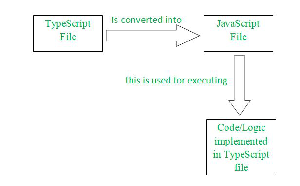

# Typescript Compiler behavior

Let's understand how TypeScript compilation works:

## Core steps of TSC

### Parsing

The TypeScript compiler parses the code to create an Abstract Syntax Tree (AST). This tree represents the structure of your code in a way that the compiler can understand and manipulate.

### Type-Checking

The compiler examines the code to determine the types of variables, functions, and expressions. This step ensures type safety by catching type-related errors before the code is executed.

### Generating JavaScript
After type-checking, the compiler produces JavaScript code. During this phase, type annotations are removed, and TypeScript-specific features are converted into JavaScript equivalents.

### Bundling (Optional)
To optimize performance, the generated JavaScript code can be bundled using tools like Webpack or Rollup. Bundling reduces the number of HTTP requests by combining multiple files into one.

### Execution
The final JavaScript code is executed in a browser or server environment.